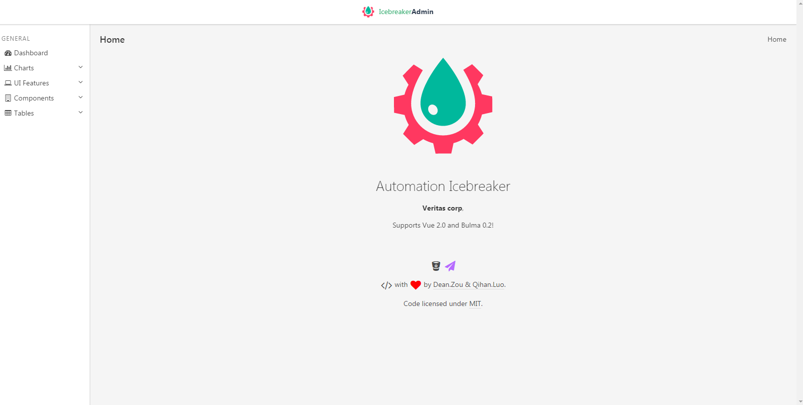

<h1>Icebreaker Admin</h1>

  <strong>Icebreaker Admin Framework</strong>,
  <a href="http://10.220.132.200/#/">visit icebreaker-admin</a>

  Made with by
    <a href="https://stash.veritas.com/users/qihan.luo/repos/async_jenkins_crawler/browse">Qihan</a> and
    <a href="https://stash.veritas.com/users/dean.zou/repos/erya/browse">Dean Zou</a>
    <a href="">contributors</a>
  

## Features

* Powered by [Vue][] **2.0** & [Bulma][] **0.2**
* Responsive and Flexible Box Layout
* Based on the awesome third-party [libraries](doc/dependencies.md)

## [Backers](backers.md)

Its ongoing development is made possible thanks to the support by these awesome backers. If you'd like to join them, check out [Vue Admin & Vue Bulma](https://www.patreon.com/_fundon)'s Patreon campaign.

## [Development](doc/development.md)

### Requirements

  * Node >= v5

  * NPM >= v3

  * Webpack v2

## Notes

## Maintainers
* Dean.Zou
* Qihan.Luo
* Sunny.Zhao
